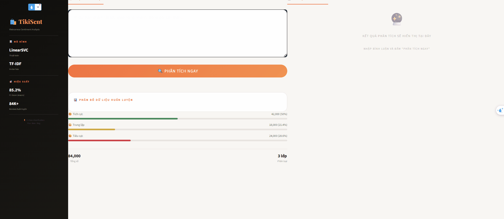

# Tiki Sentiment Analytics

Ứng dụng phân tích cảm xúc cho đánh giá sản phẩm tiếng Việt trên Tiki. Người dùng nhập một bình luận, hệ thống sẽ tiền xử lý văn bản và dự đoán một trong ba nhãn: **tiêu cực**, **trung lập** hoặc **tích cực**.



## Tính năng

- Giao diện web tương tác xây dựng bằng Streamlit.
- Chuẩn hóa tiếng lóng, sửa lỗi chính tả tiếng Việt và tách từ với `pyvi`.
- Phân loại 3 lớp bằng pipeline **TF-IDF + LinearSVC** đã huấn luyện sẵn.
- Hiển thị nhãn, phân bố điểm dự đoán và văn bản sau tiền xử lý.
- Có sẵn mã crawl đánh giá Tiki, dữ liệu, notebook làm sạch và notebook huấn luyện mô hình.

## Công nghệ

- Python
- Streamlit
- scikit-learn, joblib
- Transformers và PyTorch
- PyVi
- Pandas, NumPy, Plotly

## Cài đặt và chạy

Yêu cầu Python 3.10 trở lên. Khuyến nghị dùng môi trường ảo.

```powershell
git clone <repository-url>
cd tiki-sentiment-analytics
python -m venv .venv
.\.venv\Scripts\Activate.ps1
pip install -r requirements.txt
streamlit run app.py
```

Sau khi chạy, mở đường dẫn Streamlit hiển thị trên terminal (thường là `http://localhost:8501`). Lần chạy đầu tiên có thể mất thêm thời gian vì ứng dụng tải mô hình hiệu chỉnh tiếng Việt `bmd1905/vietnamese-correction-v2` từ Hugging Face.

## Sử dụng

1. Nhập một bình luận sản phẩm tiếng Việt vào ô nhập liệu.
2. Nhấn **PHÂN TÍCH NGAY**.
3. Xem nhãn dự đoán, tỷ lệ điểm cho ba lớp và câu đã được tiền xử lý.

Ví dụ:

```text
Sản phẩm rất tốt, giao hàng nhanh và đóng gói cẩn thận.
```

## Dữ liệu và mô hình

- `data_scraping/tiki_dataset.csv`: 84.669 đánh giá Tiki thô được thu thập.
- `data/data.csv`: 60.595 mẫu sau xử lý, gồm cột `review` và `target`.
- `data/train.csv` / `data/test.csv`: tập huấn luyện và kiểm thử (80/20).
- `sentiment_pipeline.pkl`: pipeline mô hình dùng trực tiếp bởi ứng dụng.

Quy ước nhãn:

| Giá trị `target` | Cảm xúc |
| --- | --- |
| 0 | Tiêu cực |
| 1 | Trung lập |
| 2 | Tích cực |

Kết quả thực nghiệm được lưu trong `final_results.csv` và các tệp so sánh mô hình. Theo kết quả kiểm thử đã lưu, LinearSVC đạt Macro F1 khoảng **0,61** và accuracy khoảng **0,85**. Do dữ liệu lệch về lớp tích cực, Macro F1 là chỉ số phù hợp hơn accuracy để so sánh các lớp.

## Cấu trúc thư mục

```text
.
├── app.py                        # Ứng dụng Streamlit
├── sentiment_pipeline.pkl         # Mô hình đã huấn luyện
├── requirements.txt               # Thư viện Python
├── data/
│   ├── data.csv                   # Dữ liệu đã xử lý
│   ├── train.csv                  # Tập huấn luyện
│   └── test.csv                   # Tập kiểm thử
├── data_scraping/
│   ├── scraw.py                   # Thu thập review từ Tiki
│   └── tiki_dataset.csv           # Dữ liệu crawl thô
├── data_cleaning.ipynb            # Làm sạch dữ liệu
├── models.ipynb                   # Huấn luyện và đánh giá mô hình
└── MODEL_REPORT.md                # Báo cáo chi tiết về mô hình
```

## Huấn luyện và thu thập lại dữ liệu

- Mở `data_cleaning.ipynb` để xem hoặc thực hiện quy trình làm sạch dữ liệu.
- Mở `models.ipynb` để tái tạo quy trình huấn luyện, tinh chỉnh và xuất mô hình.
- Chạy `python data_scraping/scraw.py` để thu thập lại review. Hãy kiểm tra chính sách và điều khoản sử dụng của Tiki trước khi crawl; API, cấu trúc phản hồi và giới hạn truy cập có thể thay đổi.

## Lưu ý

- `requirements.txt` hiện chứa toàn bộ môi trường phát triển, nên cài đặt có thể khá lâu.
- Không nên đưa khóa truy cập hoặc dữ liệu nhạy cảm vào repository.
